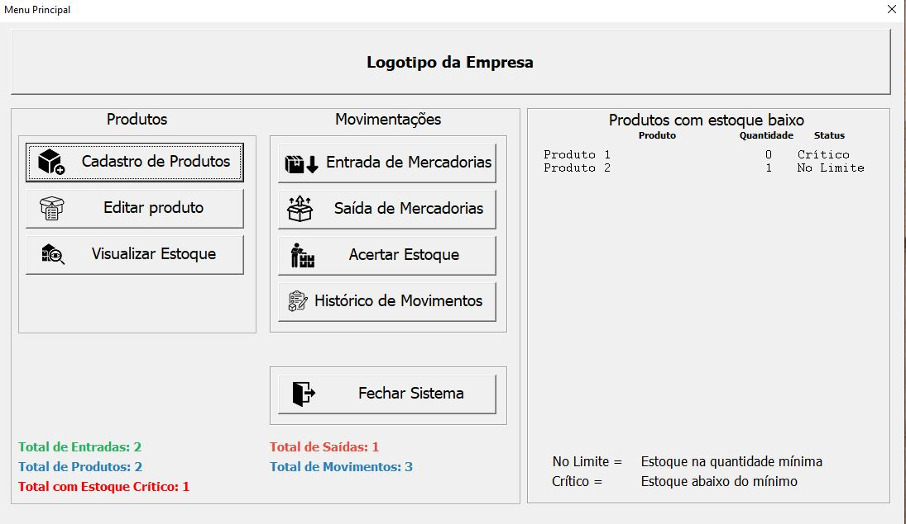
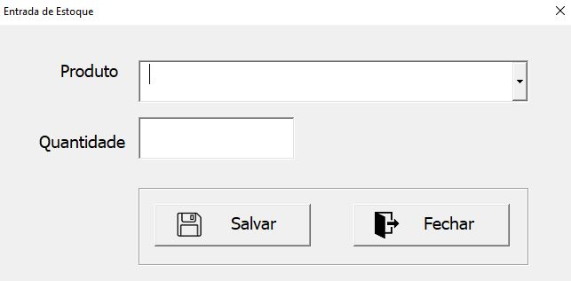
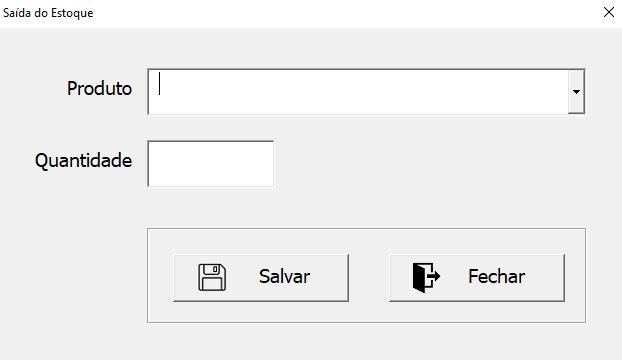

# 📦 Sistema de Controle de Estoque — Excel/VBA

Sistema de controle de estoque desenvolvido em **Microsoft Excel e VBA**, com o objetivo de automatizar e organizar processos de cadastro, controle e movimentação de produtos.

O projeto foi desenvolvido como uma solução prática para gerenciamento de estoque, utilizando recursos de programação em VBA, formulários e estruturas de dados dentro do Excel.

---

## 🎯 Objetivo

Criar uma solução para facilitar o gerenciamento de produtos e proporcionar maior controle sobre as movimentações de estoque, reduzindo tarefas manuais e organizando as informações em um único sistema.

---

## ⚙️ Principais funcionalidades

* 📦 Cadastro de produtos
* 🗂️ Cadastro de categorias
* 📊 Controle de estoque atual
* 📈 Controle de estoque disponível
* ➕ Registro de entradas
* ➖ Registro de saídas
* 🔄 Ajustes de estoque
* 📋 Histórico de movimentações
* 🔢 Geração automática de códigos de produtos
* 🖥️ Interface utilizando UserForms
* ⚙️ Automação de processos utilizando VBA
* 🔎 Consulta e organização das informações
* 💾 Backup automático do sistema
* 📅 Controle de backup diário
* 🗂️ Retenção dos últimos 15 backups
* 🧹 Exclusão automática dos backups mais antigos

---

## 🖥️ Demonstração do sistema

Abaixo estão algumas das principais telas e funcionalidades do sistema.

### 🏠 Menu Principal

### 📦 Cadastro de Mercadorias

### ✏️ Editar Produto

### 📊 Consulta de Estoque

### 📥 Entrada de Estoque

### 📤 Saída de Estoque

### 🔧 Acerto de Estoque

### 📋 Histórico de Movimentos

---

## 🗃️ Estrutura do sistema

O sistema utiliza diferentes áreas para organizar os dados e funcionalidades.

### Principais módulos e áreas

* **Cadastro**
* **Estoque Atual**
* **Movimentações**
* **Produtos**
* **Categorias**
* **Entradas**
* **Saídas**
* **Estoque**
* **Ajuste de Estoque**
* **Movimentos**

---

## 🧩 Tecnologias utilizadas

* **Microsoft Excel**
* **VBA (Visual Basic for Applications)**
* **UserForms**
* **Tabelas estruturadas**
* **Lógica de programação**
* **Automação de processos**
* **Manipulação e organização de dados**

---

## ▶️ Como executar

1. Faça o download do arquivo `.xlsm` disponível neste repositório.
2. Abra o arquivo utilizando o **Microsoft Excel para Windows**.
3. Caso o Excel solicite autorização, habilite as **macros/conteúdo** para permitir a execução do sistema.
4. Após a abertura, utilize o **Menu Principal** para acessar as funcionalidades do sistema.

> **Observação:** este projeto utiliza VBA e, por isso, requer o Microsoft Excel para Windows com suporte a macros habilitado.
  
---

## 💻 Competências técnicas demonstradas

Este projeto demonstra a aplicação prática de conhecimentos relacionados ao desenvolvimento e automação de sistemas, incluindo:

### 🔹 Programação

* Desenvolvimento de rotinas em VBA
* Criação de funções e procedimentos
* Estruturas condicionais
* Manipulação de variáveis e dados
* Automação de tarefas

### 🔹 Desenvolvimento de sistemas

* Criação de interfaces utilizando UserForms
* Implementação de regras de negócio
* Validação de informações
* Organização da lógica da aplicação
* Separação entre interface e estruturas de dados

### 🔹 Gestão de dados

* Organização de tabelas
* Cadastro e consulta de informações
* Controle de produtos
* Registro de movimentações
* Atualização de saldos de estoque
* Histórico das operações

### 🔹 Automação de processos

O sistema utiliza VBA para automatizar operações que normalmente seriam realizadas manualmente, proporcionando maior padronização e controle dos processos.

### 🔹 Análise de sistemas

O desenvolvimento do projeto envolve a identificação de necessidades, definição de regras de negócio, organização das informações e implementação de uma solução para controle de estoque.

---

## 📚 Conhecimentos aplicados

Durante o desenvolvimento deste projeto foram aplicados conceitos de:

* Lógica de programação
* Programação orientada a eventos
* Estruturação de dados
* Regras de negócio
* Automação
* Interface de usuário
* Controle de processos
* Rastreabilidade de operações
* Organização e manutenção de sistemas

---

## 🚀 Funcionalidades em desenvolvimento

## 🚀 Status do projeto

**Em desenvolvimento contínuo.**

O sistema já possui diversas funcionalidades implementadas e está sendo aprimorado com novas funcionalidades, melhorias de usabilidade, otimizações de desempenho e evolução da estrutura do projeto.

### ✅ Funcionalidades implementadas

* Cadastro e edição de produtos
* Cadastro de categorias
* Consulta de estoque
* Controle de entradas
* Controle de saídas
* Ajustes de estoque
* Histórico de movimentações
* Geração automática de códigos
* Controle de estoque disponível
* Backup automático
* Retenção dos últimos 15 backups
* Interface com UserForms
* Automação através de VBA

### 🔄 Em evolução

* Melhorias de interface e experiência do usuário
* Otimização de desempenho
* Aprimoramento dos relatórios
* controle de usuários e permissões
* Novos recursos de automação

---

## 👨‍💻 Autor

**Fernando Bueno**

Engenheiro de Computação | Analista de Sistemas | Analista de TI

Atualmente cursando Pós-Graduação em Engenharia de Software.

---

## 🎓 Objetivo profissional

Este projeto faz parte do meu portfólio de desenvolvimento e demonstra a aplicação prática de conhecimentos em **programação, automação, análise de sistemas e gerenciamento de informações**.

Meu objetivo é continuar desenvolvendo projetos práticos e realizar minha transição profissional para a área de Tecnologia.

