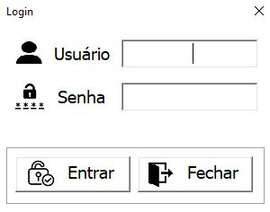
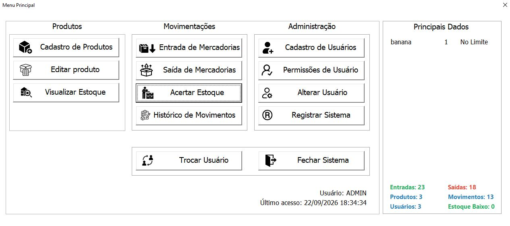
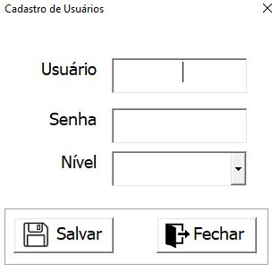
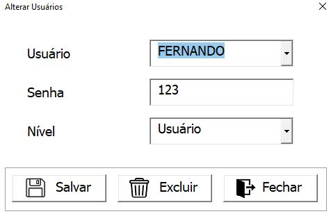
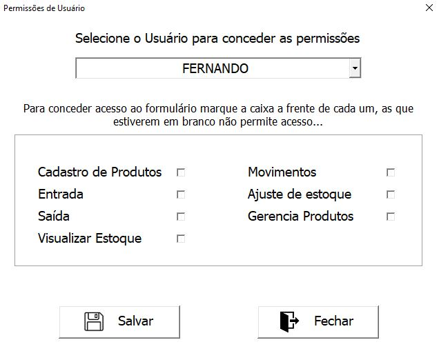

# 📦 Sistema de Controle de Estoque — Excel/VBA

Sistema de controle de estoque desenvolvido em **Microsoft Excel e VBA**, com recursos para **cadastro de produtos, controle de estoque, entradas, saídas, ajustes, histórico de movimentações, gerenciamento de usuários, controle de permissões e backup automático**.

O projeto foi desenvolvido como parte do meu portfólio profissional, com foco na aplicação prática de conhecimentos em **VBA, automação de processos, gerenciamento de dados, desenvolvimento de sistemas e análise de processos**.

---

## 📌 Sobre o Projeto

O sistema simula o funcionamento de uma solução interna para **gerenciamento de estoque**, permitindo centralizar informações de produtos, controlar movimentações e organizar o acesso dos usuários.

A aplicação permite controlar o fluxo:

**Login → Menu Principal → Cadastro → Entrada → Estoque → Saída → Ajuste → Histórico**

Além do controle de estoque, o sistema possui **gerenciamento de usuários, controle de permissões, identificação do usuário logado, registro do último acesso, geração automática de códigos e rotina de backup**, proporcionando maior organização, segurança e rastreabilidade das informações.

---

## 🎯 Objetivos

O projeto foi desenvolvido com os seguintes objetivos:

* 💻 Praticar desenvolvimento de aplicações utilizando VBA.
* 📊 Trabalhar com dados estruturados dentro do Excel.
* 📦 Desenvolver um sistema para controle de produtos e estoque.
* 🔄 Automatizar processos de entrada, saída e ajuste de estoque.
* 🖥️ Desenvolver interfaces utilizando UserForms.
* 🔐 Implementar autenticação e controle de acesso.
* 👥 Desenvolver gerenciamento de usuários e permissões.
* 🔎 Implementar consultas e organização das informações.
* 📋 Registrar o histórico das movimentações.
* 💾 Implementar rotina de backup automático.
* ⚙️ Aplicar regras de negócio em uma aplicação prática.
* 💼 Desenvolver um projeto completo para portfólio profissional.

---

## ⚙️ Funcionalidades

### 🔐 Login e Controle de Acesso

O sistema possui uma tela de login para autenticação dos usuários antes do acesso ao Menu Principal.

Principais recursos:

* Login de usuários cadastrados.
* Validação das credenciais.
* Identificação do usuário após o login.
* Controle de acesso conforme as permissões configuradas.
* Exibição do usuário logado no Menu Principal.
* Registro e exibição do último acesso do usuário.

### 👥 Gerenciamento de Usuários

O sistema permite administrar os usuários cadastrados na aplicação.

Principais operações:

* Cadastro de usuários.
* Consulta de usuários.
* Alteração de usuários.
* Gerenciamento das informações dos usuários.
* Definição de permissões de acesso.

### 🔑 Controle de Permissões

O sistema possui controle de permissões para organizar o acesso às funcionalidades disponíveis.

As permissões permitem definir quais recursos podem ser utilizados por cada usuário, proporcionando maior controle sobre as operações do sistema.

### 📦 Cadastro de Produtos

Permite realizar o cadastro e gerenciamento dos produtos do estoque.

Principais operações:

* Cadastro de produtos.
* Edição de produtos.
* Cadastro de categorias.
* Cadastro de marcas.
* Cadastro de fornecedores.
* Geração automática de códigos.
* Consulta das informações cadastradas.

### 📊 Controle de Estoque

Permite acompanhar as quantidades disponíveis dos produtos e manter o controle dos saldos de estoque.

O sistema possibilita:

* Consulta do estoque atual.
* Controle de estoque disponível.
* Atualização automática dos saldos.
* Acompanhamento das movimentações.

### 📥 Entrada de Estoque

Permite registrar entradas de produtos no estoque, atualizando automaticamente as quantidades disponíveis.

### 📤 Saída de Estoque

Permite registrar saídas de produtos e atualizar os respectivos saldos.

### 🔧 Ajuste de Estoque

Permite realizar ajustes quando é necessário corrigir a quantidade registrada no sistema.

### 📋 Histórico de Movimentações

O sistema mantém o registro das movimentações realizadas, permitindo acompanhar as operações de:

* Entradas.
* Saídas.
* Ajustes.
* Usuários.

As movimentações contribuem para a rastreabilidade das alterações realizadas no estoque.

### 💾 Backup Automático

O sistema possui uma rotina automatizada de backup que:

* Realiza backup do arquivo do sistema.
* Controla a execução do backup diário.
* Mantém os últimos 15 backups.
* Remove automaticamente os backups mais antigos.

---

## 💻 Tecnologias Utilizadas

| Tecnologia                  | Utilização                                                   |
| --------------------------- | ------------------------------------------------------------ |
| 📗 **Microsoft Excel**      | Plataforma utilizada para desenvolvimento do sistema         |
| 💻 **VBA**                  | Programação, automação e implementação das regras de negócio |
| 🖥️ **UserForms**           | Desenvolvimento das interfaces gráficas                      |
| 📊 **Tabelas estruturadas** | Organização e armazenamento dos dados                        |
| 🔐 **Controle de acesso**   | Autenticação e gerenciamento de permissões                   |
| 💾 **Sistema de arquivos**  | Rotina de backup automático                                  |
| 🌿 **Git**                  | Controle de versão                                           |
| 🐙 **GitHub**               | Hospedagem e publicação do projeto                           |

---

## 🗄️ Estrutura de Dados

O sistema utiliza estruturas de dados dentro do próprio Excel para armazenar e organizar as informações relacionadas ao controle de estoque e gerenciamento da aplicação.

Entre as principais áreas estão:

```text
Produtos
Categorias
Marcas
Fornecedores
Entradas
Saídas
Movimentos
Usuários
Permissões
Estoque
```

As movimentações são utilizadas para manter o controle dos saldos de estoque e registrar o histórico das operações realizadas.

O sistema aplica regras de negócio em VBA para:

* Cadastro e gerenciamento de produtos.
* Cadastro de categorias, marcas e fornecedores.
* Cadastro e gerenciamento de usuários.
* Controle de permissões.
* Autenticação dos usuários.
* Registro do último acesso.
* Consulta de informações.
* Registro de entradas.
* Registro de saídas.
* Ajustes de estoque.
* Atualização dos saldos.
* Registro das movimentações.
* Controle dos backups.

---

## 📁 Estrutura do Projeto

```text
sistema-controle-estoque-excel-vba/
│
├── Sistema_Controle_Estoque.xlsm
│
├── imagens/
│   ├── acerto de estoque.JPG
│   ├── alteracao-usuarios.png
│   ├── cadastro mercadorias.JPG
│   ├── cadastro-usuarios.png
│   ├── consulta estoque.JPG
│   ├── editar produto.JPG
│   ├── entrada.JPG
│   ├── historico movimentos.JPG
│   ├── login.png
│   ├── menu-principal.png
│   ├── permissoes-usuarios.png
│   └── saida.JPG
│
├── README.md
└── .gitignore
```

---

## 🧩 Organização do Sistema

O sistema é organizado em módulos responsáveis pelas diferentes áreas da aplicação.

### 📦 Produtos

Responsável pelo cadastro, edição e gerenciamento dos produtos.

### 🏷️ Categorias

Responsável pelo cadastro e organização das categorias dos produtos.

### 🏭 Marcas

Responsável pelo cadastro e organização das marcas utilizadas no sistema.

### 🚚 Fornecedores

Responsável pelo cadastro e gerenciamento dos fornecedores.

### 🔐 Usuários

Responsável pelo cadastro, consulta, alteração e gerenciamento dos usuários.

### 🔑 Permissões

Responsável pelo controle de acesso às funcionalidades do sistema.

### 📥 Entradas

Responsável pelo registro das entradas de produtos no estoque.

### 📤 Saídas

Responsável pelo registro das saídas e atualização dos saldos.

### 🔄 Movimentos

Responsável pelo registro e histórico das movimentações realizadas.

### 📊 Estoque

Responsável pela consulta e controle dos saldos disponíveis.

### 💾 Backup

Responsável pela rotina automatizada de cópia e retenção dos arquivos de backup.

---

## 🔄 Fluxo do Sistema

```text
                  ┌─────────────────────┐
                  │       LOGIN         │
                  └──────────┬──────────┘
                             │
                             ▼
                  ┌─────────────────────┐
                  │   MENU PRINCIPAL    │
                  │ Usuário + Último    │
                  │      Acesso         │
                  └──────────┬──────────┘
                             │
          ┌──────────────────┼──────────────────┐
          │                  │                  │
          ▼                  ▼                  ▼
      Produtos            Estoque           Usuários
          │                  │                  │
          ▼                  ▼                  ▼
      Cadastro         Entradas /          Permissões
      e Edição           Saídas                 │
          │                  │                  │
          └──────────────────┼──────────────────┘
                             │
                             ▼
                    Atualização do Estoque
                             │
                             ▼
                      Movimentações
                             │
                             ▼
                           Backup
```

---

## 🖼️ Demonstração

### 🔐 Login



Tela utilizada para autenticação e acesso ao sistema.

**Credenciais de demonstração:**

| Campo      | Valor   |
| ---------- | ------- |
| 👤 Usuário | `Admin` |
| 🔑 Senha   | `123`   |

---

### 🏠 Menu Principal



Tela inicial do sistema, apresentando o usuário logado e informações relacionadas ao último acesso.

---

### 👥 Cadastro de Usuários



Tela destinada ao cadastro e gerenciamento dos usuários do sistema.

---

### ✏️ Alteração de Usuários



Permite localizar e alterar informações dos usuários cadastrados.

---

### 🔑 Permissões de Usuários



Tela destinada à configuração das permissões de acesso dos usuários às funcionalidades do sistema.

---

### 📦 Cadastro de Mercadorias


Tela utilizada para cadastrar e gerenciar os produtos.

---

### ✏️ Editar Produto


Permite localizar e alterar informações dos produtos cadastrados.

---

### 📊 Consulta de Estoque


Tela utilizada para consultar as quantidades disponíveis em estoque.

---

### 📥 Entrada de Estoque


Permite registrar a entrada de produtos e atualizar o estoque.

---

### 📤 Saída de Estoque


Permite registrar a saída de produtos e atualizar os respectivos saldos.

---

### 🔧 Ajuste de Estoque


Permite realizar ajustes nas quantidades registradas no sistema.

---

### 📋 Histórico de Movimentações


Permite consultar o histórico das movimentações realizadas.

---

## 🚀 Como Executar o Projeto

### 1️⃣ Pré-requisito

É necessário possuir o **Microsoft Excel para Windows** com suporte à execução de macros VBA.

### 2️⃣ Baixar o Projeto

Faça o download do arquivo `.xlsm` disponível neste repositório.

### 3️⃣ Abrir o Sistema

Abra o arquivo utilizando o **Microsoft Excel para Windows**.

### 4️⃣ Habilitar as Macros

Caso o Excel solicite autorização, habilite as **macros/conteúdo** para permitir a execução do sistema.

### 5️⃣ Realizar o Login

Utilize as credenciais de demonstração:

```text
Usuário: Admin
Senha:   123
```

### 6️⃣ Utilizar o Sistema

Após o login, utilize o Menu Principal para acessar as funcionalidades disponíveis conforme as permissões configuradas para o usuário.

> **Observação:** o sistema foi desenvolvido em VBA e requer o Microsoft Excel para Windows com suporte a macros habilitado.

---

## 📑 Controle e Backup

O sistema possui uma rotina de backup automatizado para aumentar a segurança das informações.

O processo permite:

* 💾 Realizar backup automático.
* 📅 Controlar a execução diária do backup.
* 🗂️ Manter os últimos 15 arquivos.
* 🧹 Excluir automaticamente os backups mais antigos.

Essa funcionalidade busca reduzir o risco de perda das informações armazenadas no sistema.

---

## 🧠 Conceitos Demonstrados

Este projeto demonstra conhecimentos práticos em:

* 💻 VBA
* 📗 Microsoft Excel
* 🖥️ Desenvolvimento de interfaces com UserForms
* 🔐 Autenticação de usuários
* 👥 Gerenciamento de usuários
* 🔑 Controle de permissões
* 🧩 Programação orientada a eventos
* 📦 Regras de negócio
* 📋 CRUD e gerenciamento de informações
* 🔄 Controle de movimentações
* 📈 Controle de estoque
* 💾 Automação de backups
* 🔎 Consultas e organização de dados
* ⚙️ Automação de processos
* 📁 Organização de sistemas
* 🌿 Controle de versão com Git
* 🐙 Publicação de projetos no GitHub

---

## 🔮 Possíveis Evoluções

Como projeto de portfólio, o sistema foi desenvolvido de forma **enxuta e funcional**, mantendo o foco nas principais operações de controle de estoque e gerenciamento da aplicação.

Algumas possibilidades de evolução seriam:

* 📊 Criação de dashboards gerenciais.
* 📑 Ampliação dos relatórios.
* 🔔 Implementação de alertas de estoque mínimo.
* 📈 Inclusão de novos indicadores de movimentação.
* 🗄️ Migração dos dados para um banco de dados externo.
* 🔌 Integração com outras aplicações ou sistemas.

---

## 💼 Objetivo Profissional

Este projeto faz parte do meu portfólio de transição para a área de **Tecnologia da Informação**, demonstrando a aplicação prática de conhecimentos em **programação, automação, análise de sistemas, gestão de dados e desenvolvimento de soluções para processos empresariais**.

O objetivo é desenvolver soluções **simples, organizadas e funcionais** para problemas encontrados em ambientes corporativos.

---

## 👨‍💻 Autor

**Fernando Bueno**

**Engenheiro de Computação | Analista de Sistemas | Analista de TI**

### 🔗 Contato

[](https://www.linkedin.com/in/fernando-cesar-bueno/)

[](https://github.com/BuenoFernando)
